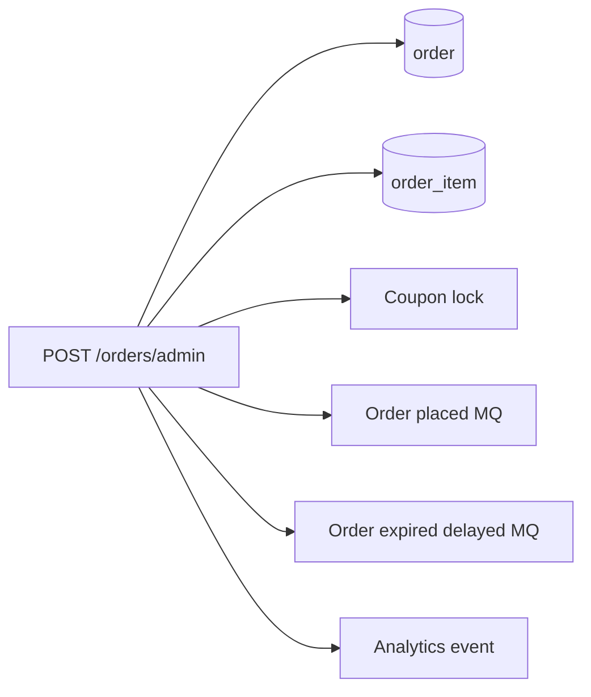
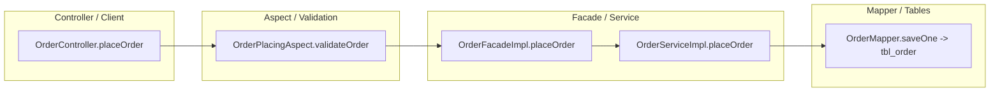
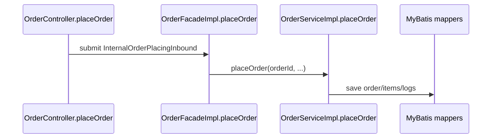

# Document Guidelines

## `flow-map.md`

Default core-flow document. Combine the business-stage view and implementation-path view so future AI agents do not have to stitch together separate files.

Include:

- Scenario name.
- Trigger.
- Preconditions.
- Main stages.
- Important branches.
- State changes.
- Entrypoint, facade/service/strategy/state/mapper classes.
- DB/MQ/external systems when they affect business meaning or change risk.
- Code evidence for important business stages, especially complex branches and state transitions.
- Mermaid flow or sequence diagram for P0/P1 flows.
- Human review items.

For P0/P1 modules, `flow-map.md` should not be a high-level summary. It should be dense enough for a future agent to safely change the flow after reading the module pack plus relevant code. Include branch tables, evidence tables, and references to module `state-machine.md`, `async-map.md`, `table-structure.md`, and `diagrams.md`.

Hard requirement for P0/P1 flows:

- Include a code-flow diagram with concrete class/method nodes. A business-only diagram such as `request -> validate -> save -> MQ` is insufficient.
- Prefer a swimlane-style `flowchart` with Mermaid `subgraph` lanes when the goal is to show layered ownership, e.g. Controller / Aspect / Facade / Service / Strategy / DB / MQ.
- Prefer `sequenceDiagram` when the goal is call order, callback order, or external interactions over time.
- The diagram must show at least the main entrypoint, validation/aspect if present, facade/service method, strategy/state/factory if present, mapper/table writes, MQ/job/external calls if present.

Prefer business-stage headings over many tiny endpoint headings.

When aligning with reference docs, do not collapse detailed business rules into a generic summary. Preserve:

- Scenario-specific validation lists.
- Field semantics and compatibility notes.
- Amount formulas and boundary conditions.
- State names, review nodes, and transition triggers.
- MQ topic/tag/producer/consumer tables.
- Cross-system steps that are business-visible even if implemented in another service.

Example:

```markdown
## 提交流程

适用场景：
- 普通提交
- 批量提交
- 需要审批的提交
- 可自动通过的提交

主链路：
1. 创建主记录。
2. 写入初始状态和明细。
3. 根据类型进入审批、履约、回调或完成分支。

待确认：
- 哪些类型可以跳过审批或履约。
```

When a reference document has rich business prose, preserve its rules in `flow-map.md` and add code-evidence tables near the relevant stage. Only create separate `business-flows.md` and `code-flow-map.md` when the user explicitly asks for separated business/code views.

## `state-machine.md`

Create when a module has explicit states or lifecycle-like state behavior. This includes formal state machines, strategy factories, review workflows, callback status handling, aggregate status computation, payment/refund/fulfillment states, and job-repaired states.

Include:

- State enum location.
- State factory location.
- State class list.
- Trigger/action/next-state table.
- Stored field name and table/entity that persists the state.
- Event/review/action enums or constants that trigger transitions.
- Source evidence for every important transition.
- Mermaid `stateDiagram-v2`.
- Unknown transitions as `待人工确认`.

Focus on what happens when entering a state:

- DB updates.
- Review record changes.
- MQ sent.
- External system called.
- Next state chosen.

Transition table format:

| From state | Trigger/event | Action code | Next state | Side effects | Evidence |
|---|---|---|---|---|---|
| `AWAITING_FULFILLMENT` | fulfillment success callback | `FulfillmentSuccessStrategy.handle` | `AWAITING_SETTLEMENT` | update lifecycle log, send settlement MQ | `LifecycleState`, `FulfillmentSuccessStrategy`, source file path |

Hard requirement for P0/P1 stateful modules:

- Include both a transition table and a Mermaid `stateDiagram-v2`.
- Each transition row should name the trigger/event, action code, stored field, side effects, and source evidence.
- If the code uses strategy factories or callback handlers instead of a formal state machine, still document it as a lifecycle state machine.

## `entity-state-and-enums.md`

Create at the top level when the project has core entity states, business type enums, event enums, review enums, MQ tag constants, amount/discount type enums, or strategy-routing enums.

Include:

- Core entity and stored state fields.
- Enum class location and source file path.
- Enum values with business labels.
- Where each enum is used: state machine, strategy factory, validation, Mapper query, MQ/job routing, external payload.
- Transition constraints or allowed next states when applicable.
- Unknown or ambiguous enum meanings as `待人工确认`.

Recommended format:

```markdown
## 主生命周期状态

存储位置：
- 表字段：`<main_table>.state`
- Entity：`<DomainEntity>`
- Enum：`<DomainState>`

| Enum value | Business meaning | Stored value | Used by | Evidence |
|---|---|---|---|---|
| `AWAITING_REVIEW` | 待审核 | 待确认 | 状态机、审核策略、MQ | `<DomainState>`, `<AwaitingReviewState>` |
```

Do not list every technical enum. Prioritize enums that change behavior, routing, state, money, persistence, or cross-system contracts.

## `impact-map.md`

Use “影响面图”, not “副作用图”.

Create only for high-risk flows. It answers:

- Which tables are written?
- Which MQ messages are produced and which consumers are known?
- Which external clients are called?
- Which jobs or delayed actions are triggered?
- Which idempotency keys, locks, cache keys, or unique constraints matter?
- What can fail, and what compensates it?
- What regression checks must run before changing this flow?

Example:



For P0/P1 modules, prefer a matrix plus a Mermaid diagram. A short list is not enough.

## `async-map.md`

Create when a module has MQ, delayed messages, callbacks, jobs, retries, or compensation.

Include:

- Producers: class/method, topic/tag, payload, trigger.
- Consumers: class/method, topic/tag, payload, idempotency and retry behavior.
- External consumers: downstream owner when known; otherwise `待人工确认`.
- Delayed messages: delay key/time, scheduler, cancel/ignore conditions.
- Jobs: handler, parameters, scanned records, writes, side effects, idempotency.
- Failure and compensation notes.

Recommended format:

| Async type | Producer/trigger | Topic/Tag or Job | Payload/params | Consumer/handler | Idempotency | Failure/compensation | Evidence |
|---|---|---|---|---|---|---|---|

## `diagrams.md`

Create module-local diagrams for P0/P1 modules. Use top-level `diagrams/` only for cross-module overview.

Required module diagrams for P0/P1 flows:

| Diagram | Mermaid type | When required | What it must show |
|---|---|---|---|
| Business flow | `flowchart` | Every P0/P1 module | Business stages, branch points, terminal states, human-visible outcomes |
| Code-flow swimlane | `flowchart` with `subgraph` lanes | Every P0/P1 module with multi-layer implementation | Concrete class/method nodes grouped by Controller/Client, Aspect/Validation, Facade, Service, Strategy/State, Mapper/DB, MQ/Job, External systems |
| Call sequence | `sequenceDiagram` | Request flows, callback flows, or external interaction flows where order matters | Participants, call order, callback/response order, transactional or async boundaries |
| State lifecycle | `stateDiagram-v2` | Modules with persisted states, review states, callback states, aggregate states, or strategy-driven lifecycle states | Stored enum/state values, triggers, approve/reject/success/failure paths, terminal states |
| Data/table relationship | `erDiagram` or `flowchart` | Modules whose table relationships carry business meaning | Primary record, detail records, log records, snapshots, relationship keys, ownership boundaries |
| Async chain | `flowchart` or `sequenceDiagram` | Modules with MQ, jobs, delayed messages, callbacks, retries, or compensation | Producer, topic/tag or job handler, payload/params, consumer, idempotency check, failure/compensation |
| Impact map | `flowchart` | High-risk flows, especially money/state/MQ/external changes | DB writes, MQ messages, RPC/external clients, cache/locks, jobs, downstream systems, regression targets |

Keep each diagram focused on one question. Use concrete class/method/topic/table names where they help navigation.

Reference-doc-style diagram standard:

When a user provides rich reference docs or asks for docs that help humans and AI quickly understand a new repository, generate diagrams at the same business granularity as the reference docs. Do not stop at a single generic flowchart.

Required business-understanding diagrams for complex P0/P1 flows:

| Diagram | Mermaid type | Purpose | Example questions it answers |
|---|---|---|---|
| Scenario split diagrams | `flowchart` | Separate major scenarios instead of merging them into one vague graph | How does create-via-A differ from create-via-B? What is special about deposit/final/associated/import flows? |
| Validation/eligibility decision tree | `flowchart` | Show every important reject/allow branch and its outcome | Which conditions block the request? Which exception/status is produced? |
| Formula/calculation diagram | `flowchart` | Show amount/quantity/resource calculation components, branches, and final persisted field | Which inputs form the final amount? How do old/new modes differ? |
| State swimlane diagram | `flowchart` with `subgraph` lanes per state/stage | Show actions grouped by persisted lifecycle state or review node | What happens in each state? Which MQ/DB/external call is triggered before moving state? |
| Scenario variant diagrams | `flowchart` | Expand high-risk variants that have different business outcomes | How do refund-only/return-refund/exchange or full/partial/failed flows differ? |
| Code evidence overlay | tables near diagrams | Tie business nodes back to class/method/file evidence | Which code implements this business node? |

System/deployment dependency diagram:

- Optional for module packs.
- Generate when config files provide reliable facts, such as `application.yml`, `application.yaml`, `bootstrap.yml`, Spring profiles, datasource/Redis/MQ properties, or environment docs.
- Use `flowchart` or C4 diagrams for service -> DB/Redis/MQ/external dependencies.
- Do not invent infrastructure from package names alone. If config is missing or ambiguous, add a `待人工确认` item.

Default diagram set for an order-management-like P0 flow:

- Business flowchart.
- Code-flow swimlane.
- Call sequence diagram.
- State lifecycle diagram when state changes are visible.
- Data/table relationship diagram.
- Async diagram when MQ/job/callback exists.
- Impact diagram.
- Scenario-specific diagrams for major variants.
- Validation/eligibility decision tree.
- Formula/calculation diagram when money/quantity/resource calculation exists.
- State swimlane diagram when the flow has persisted states, review nodes, or callback stages.

Do not make every Mermaid type mandatory. Use the required set above based on the flow's characteristics. Avoid decorative or redundant diagrams.

Recommended Mermaid diagram types for Java/Kotlin backend knowledge bases:

| Mermaid type | Use when | Required for |
|---|---|---|
| `flowchart` | Business flows, code-chain swimlanes, impact maps, data lifecycle diagrams. Use `subgraph` to create swimlanes/layers. | Most P0/P1 modules |
| `sequenceDiagram` | Request flow, callback flow, external system interactions, call order over time. | P0/P1 flows with meaningful ordering or external calls |
| `stateDiagram-v2` | Persisted lifecycle states, review states, callback states, aggregate states. | Stateful P0/P1 modules |
| `erDiagram` | Table relationships, ownership keys, detail/log/snapshot tables. | Modules where table relationships carry business meaning |
| `classDiagram` | Important interfaces/factories/strategies and their implementations. | Strategy-heavy modules when useful |
| `C4Context` / `C4Container` | Cross-system architecture and service boundaries. | Optional top-level architecture docs |
| `gantt` / `timeline` | Scheduled jobs, rollout, or time-based processes. | Optional for job-heavy docs |
| `mindmap` | Glossary or conceptual grouping. | Optional; avoid if it duplicates tables |

Avoid using charts such as `pie`, `xyChart`, `quadrantChart`, `sankey`, or `journey` by default for backend code knowledge unless they answer a concrete maintenance question.

Top-level diagram guidance:

| Top-level diagram | Mermaid type | Purpose |
|---|---|---|
| System dependency diagram | `flowchart` or `C4Context`/`C4Container` | Optional; show service boundaries and dependencies such as web/service/task, DB, Redis, MQ, payment, shipping, coupon, CRM when config/docs support it |
| Cross-module lifecycle diagram | `flowchart` or `stateDiagram-v2` | Show how the primary business record moves through creation, review, payment, fulfillment, cancellation, reversal/after-sale, and completion |
| Global MQ/job map | `flowchart` | Show major producer/consumer/topic/tag/job relationships across modules |

Do not put module-level detail in top-level diagrams. Keep top-level diagrams for cross-module orientation.

## `human-review.md`

Questions must be specific.

Good:

- `P0: 某生命周期分支是否允许跳过审批/履约？代码中存在跳过路径，但业务口径需确认。`

Bad:

- `请解释这个模块。`

## `table-structure.md`

Create only when table knowledge helps future changes.

Include:

- Core tables and their business responsibility.
- Important status/amount/type fields.
- Link status/type fields to `entity-state-and-enums.md` when the meaning is enum-driven.
- Relationship keys and ownership boundaries.
- Fields that participate in formulas, state machines, idempotency, or cross-system callbacks.
- Where to find Entity/Mapper/XML/migrations.

Prefer "business semantics + source locations" over full schema dumps. Avoid dumping every column or DDL when the source code is enough.

Example:

```markdown
## main_business_table

用途：主生命周期记录，承载业务类型、状态、金额/数量/资源字段和审批进度。

关键字段：
- `business_id`: 业务主键，下游 MQ 或外部系统可能使用。
- `state`: 主状态；若存在子状态/阶段状态，不能只看这一列判断。
- `amount` / `quantity` / `resource_count`: 参与公式或边界判断的核心字段。

关联：
- `<detail_table>.business_id`
- `<log_table>.business_id`
```

## `tags-glossary.md`

Create when agents need searchable tags and aliases.

Include:

- Business domain tags and meanings: lifecycle verbs, approval names, fulfillment names, reversal names, settlement names, import names, domain-specific aliases.
- Table tags: primary table, detail table, log table, state table, external mapping table.
- System tags: `#MQ`, `#XXL-JOB`, `#MapStruct`.
- Aliases and confusing terms.

Explain business meaning first, then add code/search aliases. Do not make this a duplicate of `mq-index.md`; MQ tag constants belong there.

## Dev Handbook Examples

When generating operation examples, make them directly usable:

- Preconditions and target layer/package.
- Naming and placement rules.
- Minimal code skeletons or pseudocode snippets.
- Idempotency, transaction, retry, and logging requirements.
- Test/checklist section.

Do not paste large existing classes. Show the smallest pattern that future agents should follow.

## Diagrams

Generate final understanding diagrams, not tool-evaluation comparison diagrams.

For AI-oriented diagrams, prioritize machine-navigable names and evidence:

- `Controller.method -> Facade/Service -> State/Strategy -> Mapper/MQ/Client`.
- MQ producer/consumer maps with topic/tag/class names.
- Job trigger maps with handler, scanned records, writes, and retry/compensation paths.
- Table/entity relationship maps for core lifecycle records.
- Entity-state diagrams with enum values, stored fields, and state classes.
- Impact maps for DB, MQ, external clients, cache, delayed jobs, and analytics.

For code-flow diagrams, prefer one of these two patterns:

Swimlane-style flowchart:



Sequence diagram:



For human-oriented diagrams, prioritize business readability:

- Scenario sequence diagrams with actors and system boundaries.
- State lifecycle diagrams using business labels plus code enum names.
- Data lifecycle diagrams showing how one primary business record and its related payment/fulfillment/review/detail records change over time.
- Module responsibility diagrams showing ownership and cross-module calls.

Use Mermaid and keep one diagram focused on one question.

## Writing Style

- Keep docs concise.
- Prefer tables and diagrams over long prose.
- Use exact class/method/file names.
- Mark uncertainty explicitly.
- Do not paste long code.
- Do not repeat schema fields unless they encode business meaning.
- If the user asked for reference-document quality, favor explicit formulas and scenario checklists over extreme brevity.
