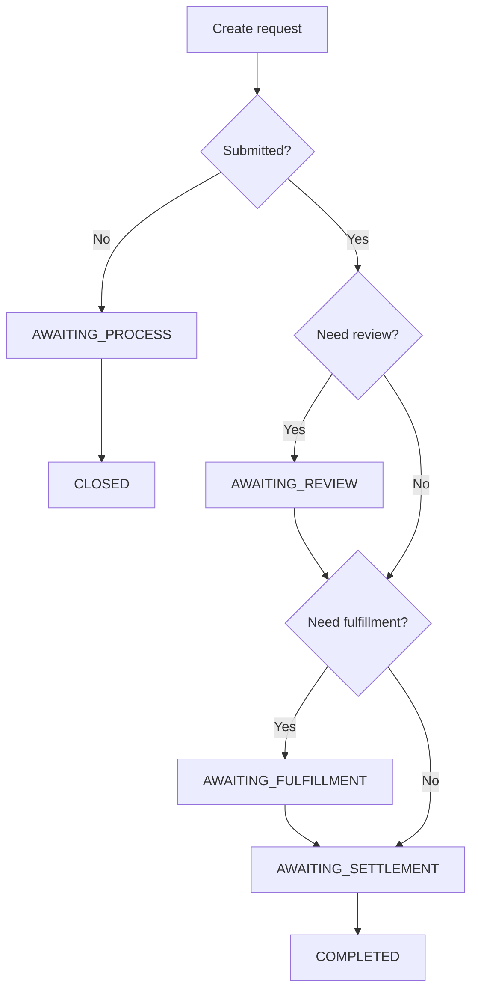
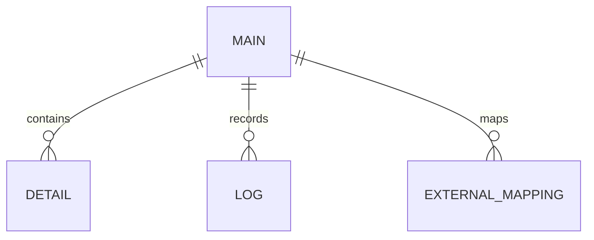

# Module Knowledge Pack Example

This reference is a domain-neutral shape distilled from a high-density lifecycle knowledge-base document. Use it as a quality and structure example. Do not copy its placeholder facts as business truth.

The original source pattern contained a complete after-service lifecycle document with scope, concepts, code navigation, states, formulas, async events, tables, and special scenarios. This example removes domain-specific facts and keeps the reusable documentation pattern.

## When To Use

Use this reference when generating a P0/P1 module for a complex backend lifecycle:

- stateful lifecycle
- money/amount/quantity/resource formulas
- approval/review nodes
- MQ callbacks or delayed messages
- jobs, retries, or compensation
- cross-system fulfillment/payment/account/resource effects
- special scenario variants

## Target Density

A P0/P1 module should be dense enough that an agent can:

1. Understand the business scope.
2. Find the main code entrypoints.
3. Trace the lifecycle state changes.
4. Reconstruct key formulas and validation rules.
5. Identify async producers/consumers/jobs.
6. Know which tables/entities/fields carry business meaning.
7. Produce a regression checklist before changing code.

Avoid one-page summaries for P0/P1 modules.

## Recommended Module Files

```text
modules/{module}/
├── README.md
├── flow-map.md
├── business-rules.md
├── state-machine.md
├── diagrams.md
├── async-map.md
├── impact-map.md
├── table-structure.md
└── human-review.md
```

## `README.md` Shape

```markdown
# {Module Name}

一句话说明该模块负责的生命周期能力。

## Business Scope

- 场景 A
- 场景 B
- 场景 C
- 完成/关闭/撤销/补偿等后置动作

## Core Systems

| System/Domain | Role | Evidence |
|---|---|---|
| local service | owns lifecycle record and state machine | `{Facade}`, `{StateFactory}` |
| external system A | fulfills/settles/refunds/provisions resources | `{Client}` / MQ tag |

## Reading Order

1. `flow-map.md`
2. `state-machine.md`
3. `business-rules.md`
4. `async-map.md`
5. `table-structure.md`
6. `impact-map.md`

## Source Confidence

- Code-confirmed facts: ...
- Reference-doc facts requiring confirmation: ...
```

## `flow-map.md` Shape

Include both business stages and code path. Do not split them into disconnected files by default.

```markdown
# {Module} Flow Map

## Scenario Scope

- Submit/create
- Validate/can-apply/can-process
- Review/approval
- Fulfillment/return/provision/reversal
- Settlement/refund/carryforward/resource transfer
- Complete/close/revoke
- Special scenario variants

## Code Navigation Index

| Business area | Entrypoints | Core classes | Notes |
|---|---|---|---|
| Eligibility | `{Client}` / `{Controller}` | `{Service.canApply}` | Finds current record, pending records, blocking states |
| Create | `{Facade.create}` | `{Service.resolveFundamental}` | Builds main record, details, initial state |
| Review | `{Facade.review}` | `{ReviewStrategyFactory}` | Review nodes and reject path |
| Fulfillment | state/MQ callback | `{AwaitingFulfillmentState}` | May call external system |

## Main Lifecycle

1. Receive request or callback.
2. Check eligibility and blocking records.
3. Resolve base data and derived amounts/resources.
4. Decide initial or next state.
5. Persist main record and details.
6. Enter state machine or strategy.
7. Produce MQ/call external systems.
8. Complete, close, revoke, or schedule compensation.

## Branch Table

| Branch | Condition | Next step | Evidence | Notes |
|---|---|---|---|---|
| Not submitted | `submitted = false` | `AWAITING_PROCESS` | `{Service.resolveNextState}` | Example placeholder |
| Skip review | `{skipReview} = true` | fulfillment/settlement | `{Service.shouldSkipReview}` | Confirm per project |
| Needs fulfillment | fulfillment state not completed | `AWAITING_FULFILLMENT` | `{State}` | External effect |

## Code Evidence

| Business step | Code evidence | Side effects |
|---|---|---|
| Eligibility check | `{Service.canApply}`, `{Mapper.findBlocking}` | Reads current and pending records |
| Create base record | `{Facade.create}`, `{Service.resolveFundamental}` | Writes main/detail records |
| Enter next state | `{StateFactory[nextState]}` | May send MQ |
```

## `business-rules.md` Shape

Write concrete rules for the target project. If the rule is from a reference doc but not code-confirmed, mark `待人工确认`.

```markdown
# {Module} Business Rules

## Eligibility

- Required condition 1.
- Required condition 2.
- Blocking condition 1.
- Blocking condition 2.

Evidence:

| Rule | Evidence | Downstream impact |
|---|---|---|
| Existing unfinished records block new requests | `{Service.canApply}`, `{Mapper.findProcessing}` | Prevents duplicate lifecycle records |

## Creation / Base Data

- How source records are loaded.
- How details/snapshots are copied.
- How special variants are detected.

## Formula Rules

Use exact project-specific formulas when code or docs support them.

```text
available_amount = total_paid - already_processed - pending_processing - transferred_amount
```

| Formula component | Meaning | Evidence |
|---|---|---|
| `total_paid` | confirmed paid amount | `{AmountService}` |
| `pending_processing` | amount reserved by in-flight records | `{Mapper.findPending}` |

## Special Scenarios

| Scenario | Condition | Behavior | Evidence | Review |
|---|---|---|---|---|
| one-to-many | source count = 1, target count > 1 | split payload or records | `{Service}` |  |
| replacement | same resource, different owner | skip/alter some fulfillment | `{Service.isReplacement}` |  |

## Close / Revoke / Reject

- Allowed states.
- Disallowed states.
- Rollback/restoration side effects.
- External notifications.
```

## `state-machine.md` Shape

Create this for formal state machines and also for strategy/callback/aggregate lifecycle states.

```markdown
# {Module} State Machine

## Implementation

- Stored field: `{table}.state`
- Entity: `{Entity}`
- Enum: `{StateEnum}`
- Factory/strategy: `{StateFactory}` / `{StrategyFactory}`
- Execution: `{StateContext}` / `{Strategy.handle}`

## State Enum

| Stored value | Enum | Business label | State/strategy class | Entry action |
|---|---|---|---|---|
| `100` | `AWAITING_PROCESS` | 待处理 | `{AwaitingProcessState}` | wait for submit/review |
| `1000` | `AWAITING_REVIEW` | 待审核 | `{AwaitingReviewState}` | create review task or wait |
| `20000` | `AWAITING_SETTLEMENT` | 待结算/退款/处理 | `{AwaitingSettlementState}` | send MQ/call external |
| `100000` | `COMPLETED` | 已完成 | `{CompletedState}` | finalize record and notify |

## Main Transition Diagram



## Transition Table

| From | Trigger/event | Action code | Next | Side effects | Evidence |
|---|---|---|---|---|---|
| `AWAITING_REVIEW` | review pass | `{ReviewStrategy.handle}` | next business state | review log, optional MQ | `{ReviewStrategyFactory}` |
| `AWAITING_SETTLEMENT` | enter state | `{AwaitingSettlementState.execute}` | waiting callback | send settlement MQ | `{MessageService}` |
| callback state | external success | `{CallbackStrategy.handle}` | `COMPLETED` or next | update external status | `{CallbackStrategy}` |

## State Entry Actions

Focus on what happens when entering a state:

- DB updates.
- MQ produced.
- External clients called.
- Next state selected.
- Idempotency checks.
```

## `async-map.md` Shape

```markdown
# {Module} Async Map

## Producers

| Stage | Producer | Topic/Tag | Payload | Trigger | Evidence |
|---|---|---|---|---|---|
| Create | `{MessageService.sendCreated}` | `{Topic}` / `{Tag.CREATED}` | `{CreatedPayload}` | after record created | `{MessageService}` |
| Await settlement | `{State.sendSettlement}` | `{Topic}` / `{Tag.AWAITING_SETTLEMENT}` | `{SettlementPayload}` | entering state | `{State}` |

## Consumers

| Topic/Tag | Consumer | Payload | Idempotency | Action | Evidence |
|---|---|---|---|---|---|
| external callback | `{CallbackStrategy}` | `{CallbackPayload}` | state/amount/business id | update state, maybe continue lifecycle | `{MessageHandlingStrategyFactory}` |

## Jobs / Delayed Actions

| Job/delay | Handler | Params/key | Scan scope | Side effects | Idempotency | Evidence |
|---|---|---|---|---|---|---|
| retry failed callback | `{TaskHandler.job}` | business id/date | failed records | resend/retry external call | status check | `{TaskHandler}` |

## Unknowns

- External consumers not visible in this repository: `待人工确认`.
```

## `table-structure.md` Shape

```markdown
# {Module} Table Structure

## Core Tables

| Table/entity | Responsibility | Important fields | Evidence |
|---|---|---|---|
| `{main_table}` / `{Entity}` | main lifecycle record | `id`, `state`, `type`, amount/resource fields | `{Entity}`, `{Mapper}` |
| `{detail_table}` | detail lines/items/resources | `main_id`, `resource_id`, quantity/amount | `{Mapper.xml}` |
| `{log_table}` | lifecycle logs | from/to state, operator, reason | `{LogMapper}` |

## Relationships



## Business Fields

- `state`: main lifecycle state; do not judge lifecycle only from child status.
- `type`: routes strategy/factory behavior.
- `amount/resource_count`: participates in formulas.
- external idempotency key: used by MQ/callback/job retry.
```

## `impact-map.md` Shape

```markdown
# {Module} Impact Map

| Area | Details | Evidence | Regression |
|---|---|---|---|
| DB writes | main/detail/log/state fields | `{Service}`, `{Mapper}` | create/update/close |
| MQ | produced and consumed tags | `{MessageService}`, `{Consumer}` | duplicate, retry, missing consumer |
| External RPC | payment/shipping/account/resource/etc. for current project | `{Client}` | timeout, partial success |
| Jobs | compensation/retry/stuck-state handlers | `{TaskHandler}` | repeat execution |
| Idempotency | business id, state check, unique key, lock | code evidence | duplicate callback/request |
| Failure consequences | over-processing, stuck state, wrong amount/resource | evidence/unknown | alert/manual repair |

## Regression Checklist

- normal create
- duplicate create/request
- review pass/reject
- callback success/failure/retry
- close/revoke
- amount/resource boundary
- special scenario variants
```

## Quality Anti-Patterns

Avoid:

- module docs that only say "see global index"
- flow maps with no branch table
- state docs with enum names but no entry actions
- impact maps with only "DB/MQ/RPC" words and no concrete classes or consequences
- table docs that only list entity names
- async docs with producer but no consumer, or no `待人工确认`
- reference-doc facts copied into a different project without evidence
