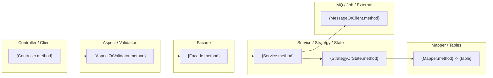
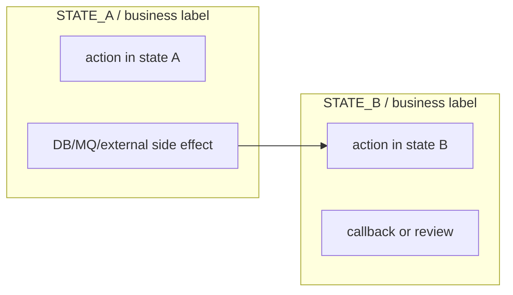
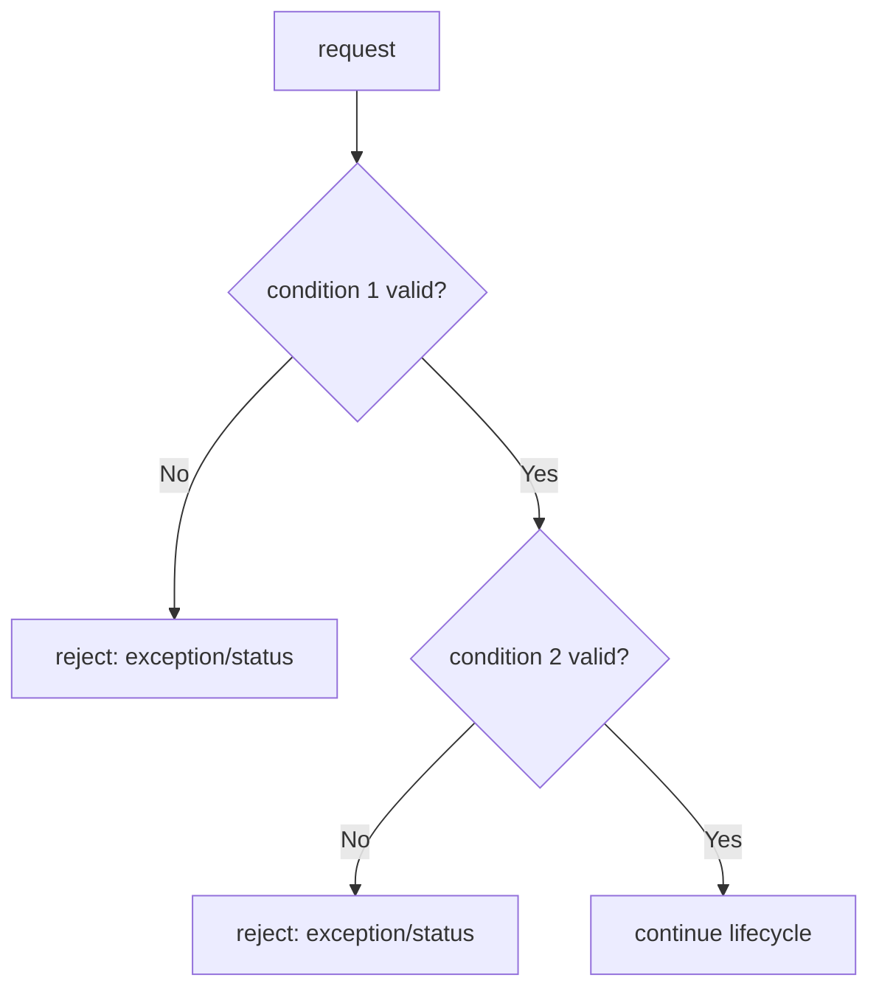
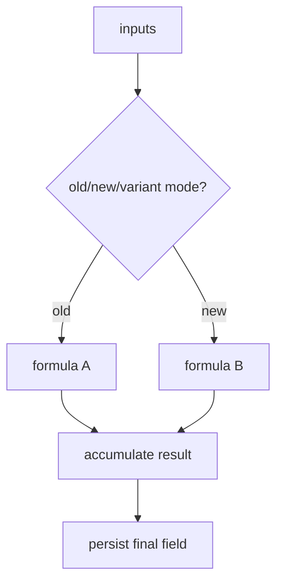

# P0 Module Golden Template

Use this as the quality template after one real P0 module has been deeply generated. It captures the expected density, diagram set, and evidence style. Keep it domain-neutral: do not copy order, payment, after-sale, or fulfillment facts into unrelated projects.

## Goal

A P0/P1 module pack should let a future AI agent safely change a core lifecycle flow after reading:

1. The module `README.md`.
2. `flow-map.md`.
3. `business-rules.md`.
4. `state-machine.md` when stateful.
5. `diagrams.md`.
6. `async-map.md` when async exists.
7. `table-structure.md`.
8. `impact-map.md`.

The pack is not complete if it only names classes or repeats obvious table names.

## Required Module Files

```text
modules/{module}/
├── README.md
├── flow-map.md
├── business-rules.md
├── state-machine.md
├── diagrams.md
├── async-map.md
├── impact-map.md
├── table-structure.md
└── human-review.md
```

Skip a file only when the flow truly has no evidence for that category. For selected P0/P1 lifecycle modules, most files should exist.

## `README.md` Quality Bar

Must include:

- One-paragraph module responsibility.
- Scenario scope table.
- Core systems/components table with role and evidence.
- Reading order.
- GitNexus usage record for the module.
- Source confidence section: code-confirmed facts and unresolved facts.

Template:

```markdown
# {Business Flow} Module Knowledge Pack

## Module Responsibility

{What primary lifecycle capability this module owns.}

## Scenario Scope

| Scenario | Entrypoint | Key result |
|---|---|---|
| {scenario} | `{Controller.method}` -> `{Facade.method}` | {state/write/MQ outcome} |

## Core Components

| Component | Responsibility | Evidence |
|---|---|---|
| `{Controller}` | HTTP/RPC entrypoint | `{file}:{line}` |
| `{Aspect/Validator}` | Preconditions | `{file}:{line}` |
| `{Facade}` | Orchestration | `{file}:{line}` |
| `{Service}` | Transactional writes | `{file}:{line}` |
| `{Strategy/State}` | Formula/state routing | `{file}:{line}` |
| `{MessageService/Job}` | Async side effects | `{file}:{line}` |

## GitNexus Usage

```bash
npx -y gitnexus@latest query "{business verb} {entrypoint} {core classes}" -r <repo-name>
npx -y gitnexus@latest context {MainClass} -r <repo-name>
```

GitNexus candidates were source-confirmed.
```

## `flow-map.md` Quality Bar

Must include:

- Trigger and preconditions.
- Code navigation index.
- Main lifecycle numbered list.
- Branch table.
- Business flow Mermaid.
- Code-flow swimlane Mermaid.
- Call sequence Mermaid when ordering matters.
- Source evidence in tables.

Required code-flow swimlane:



Required branch table:

| Branch | Condition | Behavior | State/data change | Evidence |
|---|---|---|---|---|
| {branch} | `{code condition}` | {what happens} | {state/table/MQ} | `{file}:{line}` |

## `business-rules.md` Quality Bar

Must include:

- Validation rules.
- Formula rules.
- Type/state/branch rules.
- Idempotency/concurrency rules.
- Counterexamples or easy mistakes.
- Downstream impact.

Rule table:

| Rule | Condition | Failure/result | Evidence | Downstream impact |
|---|---|---|---|---|
| {rule} | `{condition}` | `{exception/result}` | `{file}:{line}` | {impact} |

Formula section:

```text
derived_value = input_a + input_b - discount_or_consumed_value
```

| Component | Meaning | Evidence |
|---|---|---|
| `input_a` | {meaning} | `{file}:{line}` |

## `state-machine.md` Quality Bar

Required when the flow has persisted states, review states, callback states, aggregate states, or strategy-driven lifecycle states.

Must include:

- Stored field and entity/table.
- Enum location.
- Factory/strategy/context location.
- State/transition table.
- Mermaid `stateDiagram-v2`.
- State entry actions and side effects.

Transition table:

| From | Trigger/event | Action code | Next | Side effects | Evidence |
|---|---|---|---|---|---|
| `{STATE_A}` | {event} | `{Class.method}` | `{STATE_B}` | {DB/MQ/external/log} | `{file}:{line}` |

## `diagrams.md` Quality Bar

For P0/P1 modules, include the diagrams that match the flow:

| Diagram | Mermaid type | Required when |
|---|---|---|
| Business flow | `flowchart` | Every P0/P1 module |
| Code-flow swimlane | `flowchart` + `subgraph` | Every P0/P1 module |
| Call sequence | `sequenceDiagram` | Request/callback/external ordering matters |
| State lifecycle | `stateDiagram-v2` | Stateful flows |
| Data/table relationship | `erDiagram` or `flowchart` | Table relationships carry business meaning |
| Async chain | `flowchart` or `sequenceDiagram` | MQ/job/callback/retry exists |
| Impact map | `flowchart` | High-risk DB/MQ/RPC/cache/job/downstream effects |
| Scenario split | `flowchart` | Major business variants should be understood separately |
| Validation decision tree | `flowchart` | Multiple reject/allow branches exist |
| Calculation diagram | `flowchart` | Money/quantity/resource formulas exist |
| State swimlane | `flowchart` with `subgraph` lanes per state/stage | Persisted states, review nodes, callback stages, or job-repaired states exist |
| System dependency | `flowchart` or C4 | Optional; only when config/docs reliably identify DB/Redis/MQ/external dependencies |

All diagrams should use concrete class/method/table/topic names when useful.

Reference-doc-style diagram plan:

```markdown
## Diagram Plan

| Diagram | Why needed | Source evidence |
|---|---|---|
| Scenario split | {major variants differ} | {endpoints/classes/docs} |
| Validation decision tree | {many blocking conditions} | {validator/aspect/service} |
| Calculation diagram | {formula-heavy logic} | {calculator/strategy} |
| State swimlane | {state/review/callback lifecycle} | {state enum/factory/strategy} |
| Code swimlane | {implementation navigation} | {GitNexus + source} |
```

State swimlane pattern:



Validation decision tree pattern:



Calculation diagram pattern:



## `async-map.md` Quality Bar

Required when the module uses MQ, jobs, callbacks, delayed messages, retries, or external async calls.

| Async type | Producer/trigger | Topic/Tag or Job | Payload/params | Consumer/handler | Idempotency | Failure/compensation | Evidence |
|---|---|---|---|---|---|---|---|
| MQ | `{Class.method}` | `{topic}/{tag}` | `{Payload}` | `{Consumer or 待人工确认}` | {key/status check} | {retry/job/log} | `{file}:{line}` |

## `table-structure.md` Quality Bar

Must explain business semantics, not full DDL.

Include:

- Mermaid `erDiagram` or relationship `flowchart`.
- Core table responsibilities.
- Relationship keys and ownership boundaries.
- Status/type/amount/idempotency/historical fields.
- Entity/Mapper/XML/migration locations.
- Which method owns each write.

Table section:

```markdown
### `{table}` / `{Entity}`

Purpose: {business responsibility}

Locations:
- Entity: `{path}`
- Mapper: `{path}`
- XML: `{path}`
- Migration: `{path}`

Key business fields:

| Field | Meaning | Writer/evidence |
|---|---|---|
| `{field}` | {meaning} | `{Class.method}` / `{file}:{line}` |
```

## `impact-map.md` Quality Bar

Must include a matrix and a Mermaid impact diagram.

| Change point | DB writes | MQ/async | External systems | Cache/locks | Failure consequence | Regression checks |
|---|---|---|---|---|---|---|
| {change} | {tables} | {topics/jobs} | {clients} | {keys/locks} | {risk} | {checks} |

## `human-review.md` Quality Bar

Questions must be specific and answerable.

| Priority | Question | Current code evidence | Why confirm |
|---|---|---|---|
| P0 | {question} | `{file}:{line}` | {risk} |

## Final Self-Check

Before finishing a P0/P1 module:

- The module has concrete code-chain diagrams, not just business boxes.
- Every important rule points to source evidence.
- Every table doc explains fields that carry business meaning.
- Async docs include idempotency and failure/compensation.
- State docs include transitions and entry actions.
- `human-review.md` captures unresolved product/dev questions.
