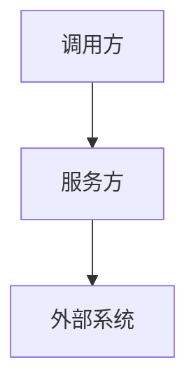

# 后端技术方案模板

用于生成后端技术方案。默认让业务、产品、开发都能看懂；必要技术字段保留，方便后续编码。前端改动使用 `references/frontend-tech-template.md` 生成独立前端技术方案。

## 输出模式

默认使用“简版（低 token）”；当需求满足任一升级条件时，使用“完整版”：
- 跨模块联动
- 存在外部依赖调用
- 存在数据写入/异步一致性设计

要求：
- 业务叙述中不出现具体项目名，统一使用中性命名（如：调用方/服务方/外部系统）；代码影响范围可以标注真实项目名和相对路径。
- 技术方案第一节必须是 `需求依据`，用于引用原始钉钉链接、整理后需求文档、引用需求资料、按需生成的原始需求留存单或对话确认记录。
- 生成完成态技术方案前必须先完成需求理解校准；高影响不确定项只有在用户明确同意按假设推进后，才能进入 `assumptions_recorded`。
- 技术方案引用现有接口、URL、Controller、DTO、Service、Mapper、表、字段、数据来源、关联键或导出能力时，必须先核验核心代码声明，并标注 `confirmed` / `refuted` / `unverified`；影响实现范围、数据正确性、接口契约或核心数据链路的 `refuted` / `unverified` 必须进入待确认事项。
- 新增或改造接口必须说明 URL、Method、Auth、请求字段、响应字段、错误码。
- 当接口涉及写入、副作用、跨服务调用或外部消费时，还必须补充幂等策略、超时与重试、请求示例、响应示例。
- 既有接口改造优先输出变更 diff，避免重复贴全量结构。
- 先用直白语言说明“本期做什么、怎么处理、怎么验证”，再补充必要技术细节。

## 接口契约

新增或改造接口的基础必填项：
- `URL`
- `Method`
- `Auth`
- `请求字段定义`（字段名/类型/是否必填/业务含义/默认值或枚举）
- `响应字段定义`（字段名/类型/业务含义）
- `错误码映射`（错误码/含义/处理方式）

按需补充项（写入、副作用、跨服务调用、外部消费任一命中则必填）：
- `幂等策略`
- `超时与重试`
- `请求示例`
- `响应示例`

## 复杂逻辑场景清单

当需求包含多种状态流转、多个判断分支、异常处理、异步处理、第三方对接、权限差异、批量处理、多来源合并、初始化、补录、迁移、历史复刻、兜底取值任一情况时，技能应提示可能命中复杂逻辑。未识别到复杂逻辑信号时，不额外打断用户，技术方案记录 `复杂逻辑信号：未识别；是否命中复杂逻辑：否（按简单需求处理）`。

复杂逻辑确认规则：
- 仅在识别到复杂逻辑信号时，技能先给出 `复杂逻辑信号` 和 `推荐选择`，再让使用者选择 `是 / 否 / 不确定`。
- 识别到复杂逻辑信号时，最终 `是否命中复杂逻辑` 必须来自使用者选择，不能由技能直接替用户定为 `是`。
- 若选择 `是`，必须填写场景清单。
- 若选择 `否`，只记录不按复杂逻辑处理的原因，不输出空的完整场景表。
- 若选择 `不确定` 且影响范围、数据写入、接口行为、时间规则、权限或验收，必须进入待确认。

复杂逻辑命中后：
- 必须先展示已识别场景，并确认是否需要补充场景。
- 确认结果写入 `场景补充确认`。
- `场景补充确认` 固定值：`不需要补充`、`需要补充`、`不确定`。
- 若选择 `需要补充`，必须把补充内容合并进场景清单后再写接口和数据方案。
- 若选择 `不确定` 且影响范围、数据写入、接口行为、时间规则、权限或验收，必须进入待确认。
- 场景清单字段固定为：`场景ID | 什么时候发生 | 当前状态 | 输入内容 | 怎么处理 | 处理结果 | 异常情况 | 怎么验证`。
- 多来源合并、初始化、补录、历史复刻类需求可补充字段：`是否写入 | 写入类型 | 时间取值规则 | 来源优先级`。
- 有 `第一条`、`最新一条`、`早于`、`晚于`、`按时间线复刻`、`兜底` 规则时，场景里必须写清楚时间和值怎么取。
- 后续 `实施映射（供灵犀·代码实现）` 必须关联相关 `场景ID`。

## 简版模板（默认）

```md
# 技术方案（简版）

## 1. 需求依据
- 原始需求链接：
  - 钉钉链接：
  - 钉钉标题或节点：
- 整理后需求文档：
  - 需求清单：
  - 需求收集单：
  - 原始需求留存单（按需）：
  - 本地需求文档：
- 引用需求资料：
  - 已读取的关键引用：
  - 未读取但已登记的引用：
  - TAPD 链接及上下文：
  - 引用资料缺口：
- 对话确认记录：
  - 是否仅通过对话确认：是 / 否
  - 用户是否选择整理为需求文档：已整理 / 不整理，按对话确认推进 / 待确认
  - 对话确认摘要：
- 来源完整性：完整 / 部分完整
- 来源缺口：
1.
2.
- 主依据：
- 补充依据：
- 冲突处理结论：

## 2. 目标与验收
- 目标：
- 验收口径：
1.
2.
3.

## 3. 范围
- 本期要做：
1.
2.
- 本期不做：
1.
2.
- 非目标（明确不覆盖）：
1.

## 4. 影响范围
- 影响范围来源：真实代码扫描 / 基于需求推断，未做代码扫描验证
- 受影响模块：
  1.
  2.
- 受影响接口：
  1.
  2.
- 受影响数据：
  1.
  2.
- 受影响链路：
  1.
  2.
- 不受影响：
  1.
  2.

## 4.1 核心代码声明核验
| 声明 | 核验状态 | 证据（repo-relative path:line） | 影响 |
| --- | --- | --- | --- |
|  | confirmed / refuted / unverified |  |  |

## 5. 复杂逻辑确认
- 复杂逻辑信号：
- 推荐选择：是 / 否（无复杂逻辑信号时写“无，不询问”）
- 是否命中复杂逻辑：是 / 否 / 不确定（无复杂逻辑信号时写“否，按简单需求处理”）
- 不按复杂逻辑处理的原因（选择“否”时填写）：

<!-- 仅当“是否命中复杂逻辑=是”时输出以下场景清单；选择“否”时不要输出空表。 -->

## 5.1 场景清单（复杂逻辑命中时填写）
- 场景补充确认：
  - 已识别场景摘要：
  - 是否需要补充场景：不需要补充 / 需要补充 / 不确定
  - 补充说明或待确认：

| 场景ID | 什么时候发生 | 当前状态 | 输入内容 | 怎么处理 | 处理结果 | 异常情况 | 怎么验证 |
| --- | --- | --- | --- | --- | --- | --- | --- |
| S1 |  |  |  |  |  |  |  |

## 6. 接口设计（怎么传、怎么返回、失败怎么办）
### 6.1 新增接口（若有）
- URL:
- Method:
- Auth:
- 请求字段定义：
| 字段名 | 类型 | 是否必填 | 业务含义 | 默认值或枚举 |
| --- | --- | --- | --- | --- |
|  |  |  |  |  |
- 响应字段定义：
| 字段名 | 类型 | 业务含义 |
| --- | --- | --- |
|  |  |  |
- 错误码映射：
| 错误码 | 含义 | 处理方式 |
| --- | --- | --- |
|  |  |  |
- 按需补充（写入/副作用/跨服务/外部消费时必填）：
  - 幂等策略：
  - 超时与重试：
  - 请求示例：
  - 响应示例：

### 6.2 既有接口改造（若有）
- 变更点（diff）：
1. 新增字段：
2. 变更字段：
3. 废弃字段：
- 兼容策略：

## 7. 数据与一致性
- 存储变更（DB/缓存/索引）：
- 一致性策略（同步/异步/补偿）：
- 防重或幂等（有写入时填写）：

## 8. 异常与降级
- 超时：
- 重试：
- 熔断/限流：
- 回滚/补偿：

## 9. 风险评估
- 如果不做会怎样：
- 做了有什么风险：
- 风险如何降低：
- 是否可继续：

## 10. 验证计划
- 功能用例：
- 异常用例：
- 回归范围：
- 观测项（日志/指标/告警）：
- 可执行断言建议：
  - 前置：
  - 输入：
  - 期望：

## 11. 方案生成自检
| 自检项 | 结论 | 证据或缺口 |
| --- | --- | --- |
| 需求上下文清楚 | 是 / 否 |  |
| 实施端完整 | 是 / 否 |  |
| 核心代码声明已验证 | 是 / 否 / 不适用 |  |
| 数据链路 / 接口契约闭环 | 是 / 否 / 不适用 |  |

## 12. 待确认事项
1.
2.

## 13. 实施映射（供灵犀·代码实现）
| 方案项 | 关联场景ID | 目标模块/接口 | 验证点 |
| --- | --- | --- | --- |
|  |  |  |  |
```

## 完整版模板（升级后）

~~~md
# 技术方案（完整版）

## 一、需求依据
- 原始需求链接：
  - 钉钉链接：
  - 钉钉标题或节点：
- 整理后需求文档：
  - 需求清单：
  - 需求收集单：
  - 原始需求留存单（按需）：
  - 本地需求文档：
- 引用需求资料：
  - 已读取的关键引用：
  - 未读取但已登记的引用：
  - TAPD 链接及上下文：
  - 引用资料缺口：
- 对话确认记录：
  - 是否仅通过对话确认：是 / 否
  - 用户是否选择整理为需求文档：已整理 / 不整理，按对话确认推进 / 待确认
  - 对话确认摘要：
- 来源完整性：完整 / 部分完整
- 来源缺口：
1.
2.
- 主依据：
- 补充依据：
- 冲突处理结论：

## 二、背景
- 现状问题：
- 本次目标：
- 非目标（明确不覆盖）：

## 三、总体方案
- 主流程说明：
- 关键决策：
1.
2.
- Mermaid 主流程图：


## 四、影响范围
- 影响范围来源：真实代码扫描 / 基于需求推断，未做代码扫描验证
| 影响项 | 影响类型 | 影响原因 | 处理方式 |
| --- | --- | --- | --- |
|  |  |  |  |
- 不受影响：
1.
2.

### 4.1 核心代码声明核验
| 声明 | 核验状态 | 证据（repo-relative path:line） | 影响 |
| --- | --- | --- | --- |
|  | confirmed / refuted / unverified |  |  |

## 五、复杂逻辑确认
- 复杂逻辑信号：
- 推荐选择：是 / 否（无复杂逻辑信号时写“无，不询问”）
- 是否命中复杂逻辑：是 / 否 / 不确定（无复杂逻辑信号时写“否，按简单需求处理”）
- 不按复杂逻辑处理的原因（选择“否”时填写）：

<!-- 仅当“是否命中复杂逻辑=是”时输出以下场景清单；选择“否”时不要输出空表。 -->

### 5.1 场景清单（复杂逻辑命中时必填）
- 场景补充确认：
  - 已识别场景摘要：
  - 是否需要补充场景：不需要补充 / 需要补充 / 不确定
  - 补充说明或待确认：

| 场景ID | 什么时候发生 | 当前状态 | 输入内容 | 怎么处理 | 处理结果 | 异常情况 | 怎么验证 |
| --- | --- | --- | --- | --- | --- | --- | --- |
| S1 |  |  |  |  |  |  |  |

## 六、接口定义（怎么传、怎么返回、失败怎么办）
### 6.1 新增接口（逐个）
- 接口名：
- URL / Method / Auth：
- 请求字段定义（字段名/类型/是否必填/业务含义/默认值或枚举）：
- 响应字段定义（字段名/类型/业务含义）：
- 错误码映射（错误码/含义/处理方式）：
- 按需补充（写入/副作用/跨服务/外部消费时必填）：
  - 幂等策略：
  - 超时与重试：
  - 请求示例：
  - 响应示例：

### 6.2 既有接口改造
- 接口名：
- 变更 diff：
- 兼容策略（向后兼容/灰度）：

## 七、存储与数据流
- 表/缓存/索引变更：
- 字段定义（类型、默认值、约束）：
- 数据流向（写入/读取/异步）：
- 一致性与幂等：

## 八、资源与配置
- 配置项新增/变更：
- 任务与队列资源：
- 容量预估：

## 九、异常、降级与回滚
- 降级触发条件：
- 降级行为：
- 回滚步骤：
- 风险兜底：

## 十、风险与验证
- 风险清单：
| 风险点 | 影响 | 缓解方式 | 是否可继续 |
| --- | --- | --- | --- |
|  |  |  |  |
- 验证清单：
1. 功能
2. 异常
3. 回归
4. 观测
5. 可执行断言（前置/输入/期望）

## 十一、方案生成自检
| 自检项 | 结论 | 证据或缺口 |
| --- | --- | --- |
| 需求上下文清楚 | 是 / 否 |  |
| 实施端完整 | 是 / 否 |  |
| 核心代码声明已验证 | 是 / 否 / 不适用 |  |
| 数据链路 / 接口契约闭环 | 是 / 否 / 不适用 |  |

## 十二、待确认事项
1.
2.

## 十三、实施映射（供灵犀·代码实现）
| 方案项 | 关联场景ID | 目标模块/接口 | 验证点 |
| --- | --- | --- | --- |
|  |  |  |  |
~~~

## 约束

- 技术方案第一节必须保留 `需求依据`；不能把需求来源只放在末尾、交接摘要或 `RequirementContext` 里。
- 需求中出现钉钉引用文档、TAPD 链接或其他需求来源链接时，必须在第一节 `引用需求资料` 中体现；TAPD 不能伪装成已读取，无法读取时记录上下文和缺口。
- 纯对话确认的需求在完成态技术方案前，必须记录用户对“是否整理为需求文档”的选择。
- URL 必须符合现有路由规范。
- 字段定义必须包含“类型 + 业务含义”。
- 影响范围只有在真实扫描代码后才能声明“来自真实代码扫描证据”；否则必须标记为“基于需求推断，未做代码扫描验证”。
- 引用现有核心代码事实时必须先核验；未核验的核心事实不能写成确定方案。核心核验只覆盖接口路径、Controller / Service / DTO / Mapper、表字段、数据来源、关联键、过滤/排序条件和既有导出能力；权限、日志、回滚、测试覆盖暂不作为本阶段硬门禁。
- 多项目代码影响范围必须标注 `[项目名: 相对路径]`；业务叙述仍使用中性名称。
- 若存在跨项目调用，必须描述调用链、接口契约、数据流向。
- 确认命中复杂逻辑后，必须先列场景清单，再写接口和数据方案。
- 完成态前必须填写 `方案生成自检`；任一核心项为否且影响实现范围、数据正确性、接口契约或核心数据链路时，技术方案保持待确认。
- 输出里避免不必要的黑话；无法避免的技术词要配合直白说明。

## 排除内容

- 前端/移动端交互设计（本后端模板不覆盖；前端改动使用 `frontend-tech-template.md`）
- 埋点/数据上报
- A/B 测试配置
- UI/UX 细节（本后端模板不覆盖；前端方案可引用 UI 设计和交互验收）

## 输出建议

- 使用中文。
- 对不确定项统一写入“待确认事项”，不得猜测。
- 优先使用“本期做什么 / 本期不做什么 / 怎么验证 / 还有哪些不确定”这类表达。
- 影响范围条目建议按“模块/文件 | 影响类型 | 影响原因”表格输出。
